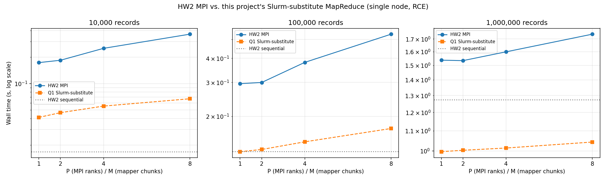
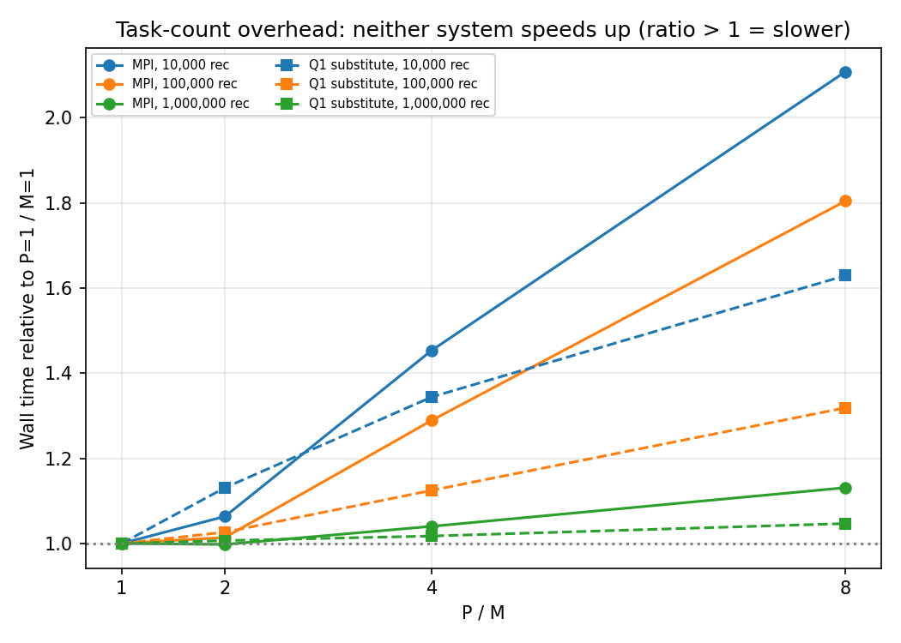

# HW3 Section 2 · Q1 — Hadoop MapReduce (HW2 Q8 Weather Analytics)

A Hadoop Streaming (C++) MapReduce re-implementation of HW2 Q8's Large-Scale
Weather and Environmental Data Analytics. Produces byte-for-byte identical
output to the unmodified HW2 sequential program
(`weather_seq_reference/weather_seq.cpp`) — the analytics, output format,
and tie-break rules are unchanged from HW2; only the distribution mechanism
is new.

## Architecture and data flow

```
dataset (N K S header + N records)
      |
      |  driving script strips the header, keeps records only
      v
mapper.cpp  x M              (M = number of Hadoop mapper tasks)
      |
      |  Hadoop shuffle/sort groups lines by key
      v
reducer.cpp x R               (R = number of Hadoop reduce tasks, configurable)
      |
      |  small (~1440 + S row) summarized output
      v
finalize.py --k K             (NOT a MapReduce step)
      |
      v
exact HW2 Q8 output (19 lines)
```

One real Hadoop Streaming job (`mapper.cpp` + `reducer.cpp`), followed by a
small, deliberately non-distributed finishing script (`finalize.py`). This
is Design 3 from the approved architecture
(`/Users/charan/.claude/plans/atomic-painting-globe.md`) — see that plan for
the full comparison against the alternative two-Hadoop-job design.

## Mapper: input and emitted keys/values

`mapper.cpp` reads **only** measurement records from stdin — one per line:

```
timestamp station_id temperature humidity pressure rainfall wind_speed
```

It never sees the dataset's `N K S` header line; stripping that header is
the driving script's job (see "K handling" below), because a real Hadoop
input split never contains anything but data records.

The mapper accumulates state across its *entire* assigned split (not one
line at a time — this mirrors one MPI rank's local loop in HW2's
`weather_mpi.cpp`) and, at EOF, emits three kinds of `key<TAB>value` lines:

| Key | Value | Meaning |
|---|---|---|
| `GLOBAL` | 21 space-separated fields (count, 5 Kahan sums, min/max bounds, extreme count, hottest/coldest candidate) | This mapper's entire-split partial summary — exactly one line per mapper |
| `INTERVAL_<id>` | local count | This mapper's contribution to that 60-second interval |
| `STATION_<id>` | `count sum_temp sum_rainfall` | This mapper's contribution to that station |

Numerical behavior (Kahan summation, via `src/common/kahan.hpp`) and the
hottest/coldest tie-break (max/min temperature; tie → smaller timestamp;
tie → smaller station_id) are preserved exactly from HW2.

## Reducer: aggregation, and why GLOBAL is one key

`reducer.cpp` reads the shuffle-sorted stream and detects key-boundary
changes itself (standard Hadoop Streaming contract — same-key lines are
adjacent after the sort, but not pre-grouped into lists).

- **`GLOBAL`** is a single constant key, so *every* mapper's `GLOBAL` line
  always routes to the *same one* reducer instance, for any number of
  reduce tasks — Hadoop's partitioner is a deterministic function of the
  key string alone. That reducer therefore sees all M partials and finishes
  Shape A completely: one more Kahan pass over the already-compensated
  partial sums (not a plain running `+=`, for the same non-associativity
  reason documented in HW2's own code), plain min/max, and the same
  hottest/coldest comparator re-applied across the mappers' local
  candidates. Nothing about Shape A needs anything past this point, so the
  reducer prints it directly in final 2-decimal Q8 format.
- **`STATION_<id>` / `INTERVAL_<id>`** likewise always route to one reducer
  instance *per distinct id* (same reasoning, just per-key instead of one
  global key), so each id's total is complete and exact — never split
  across two reducers. But with more than one reduce task, *different* ids
  can land on *different* reducers, so no single reducer ever sees every
  interval or every station. These are printed as complete-but-unranked
  intermediate rows.

## Why station ranking and busiest interval are finalized outside Hadoop

Finding the single busiest interval and the top-K stations both need a view
across *every* interval/station id — something no individual reducer
instance has when there's more than one reduce task. A second real
MapReduce job could resolve this, but it isn't needed: the data involved is
provably tiny regardless of N. Interval ids are capped at `86400/60 = 1440`
by the dataset generator's fixed 24-hour timestamp window; station ids are
capped at S. For N=1,000,000, that's roughly a 1000:1+ compression ratio.
Wrapping a second Hadoop job around data that small buys nothing but extra
job-launch overhead, so `finalize.py` does this one small, ordinary,
non-distributed pass instead — the same pattern HW2's `weather_mpi.cpp`
already uses for its own final top-K sort and formatting, once its
collectives are done. See the approved plan (section 2) for the full
three-design comparison this decision is based on.

## K handling (and N / S)

The dataset's header line is `N K S`. None of the three reach the mapper or
reducer:

- **N** (total records) is never read as input anywhere — it's *derived*,
  as the sum of every mapper's local count, accumulated through the
  `GLOBAL` key. `TOTAL_MEASUREMENTS` falls out of the pipeline
  automatically.
- **S** (station-id range) is descriptive dataset-generation metadata,
  never consumed by the analytics at all — `weather_seq.cpp` itself reads
  it and never uses it again.
- **K** (top-K cutoff) is needed only by `finalize.py`, since neither
  mapper nor reducer truncate anything — the reducer keeps *complete*
  per-station totals for every station. Driving scripts
  (`run_local_pipe_test.sh`, `run_hadoop.sh`) read `N K S` off the original
  file's first line, strip that header before the data reaches the mapper,
  and pass `K` to `finalize.py` via `--k`. `finalize.py` requires `--k` on
  the command line and never defaults or invents a value.

## Compiling

```bash
g++ -O2 -std=c++17 -Wall -Wextra -pedantic -Isrc src/mapper.cpp  -o build/mapper
g++ -O2 -std=c++17 -Wall -Wextra -pedantic -Isrc src/reducer.cpp -o build/reducer
g++ -O2 -std=c++17 -Wall -Wextra -pedantic weather_seq_reference/weather_seq.cpp -o build/weather_seq
g++ -O2 -std=c++17 -Wall -Wextra -pedantic generate.cpp -o build/generate
```

`scripts/run_local_pipe_test.sh` and `scripts/run_hadoop.sh` both do this
compilation step themselves, so it is not a separate prerequisite before
running either.

## Local correctness testing

```bash
scripts/run_local_pipe_test.sh                       # auto-generates a small dataset
scripts/run_local_pipe_test.sh -d path/to/data.txt    # use a specific dataset
scripts/run_local_pipe_test.sh -d data.txt -m 5       # split into 5 mapper chunks
```

This test **deliberately** splits the dataset's records into multiple
chunks and runs `mapper.cpp` independently on each one, then concatenates
and sorts their output before feeding it to `reducer.cpp` — simulating real
multiple-mapper-task shuffle/sort, not just a single mapper's pass-through.
This is what actually exercises `reducer.cpp`'s cross-mapper combining
logic (summing partial counts/sums that share a `STATION_*`/`INTERVAL_*`
key from *different* mapper chunks) rather than trivially validating a
single mapper's own already-correct local state.

The pipeline's final output is compared, via `scripts/compare_correctness.sh`,
against `weather_seq_reference/weather_seq.cpp` run on the *same* dataset.
**`weather_seq_reference` is the correctness oracle for this entire
project** — it is HW2's unmodified, independently verified sequential
implementation, and it is never modified to make the Hadoop pipeline's
output match it; only the Hadoop-side code changes if a mismatch is found.

**Known, confirmed, benign exception — a floating-point precision tie at N=100,000.**
Real RCE benchmarking (`scripts/benchmark.sh`, job 98781, node06, x86_64) found
`AVERAGE_WIND_SPEED` disagreeing with the oracle at N=100,000, for *every* mapper-chunk
count (1, 2, 4, 8): the oracle prints `60.115214`, the pipeline prints `60.115213`. Exact
rational verification against the actual dataset (`Fraction`/`Decimal` arithmetic, no floating
point) gives the true average as exactly `60.1152135` — a genuine halfway point — which
round-half-even correctly resolves to `.115214`. This is not a logic bug: `kahan.hpp`'s
`KahanSum::value()` narrows its internal `long double` accumulator to `double` before the
mapper writes it out as text (unavoidable — the Hadoop Streaming stdin/stdout contract is a
`double`-precision text protocol, not a `long double` one), and the reducer's own final average
division (`sum.value() / static_cast<double>(count)`) therefore happens in `double` arithmetic.
The oracle, by contrast, stays in `long double` for the entire single-pass summation and only
narrows to `double` at the very last step. Different summation/rounding paths landing on
opposite sides of one exact halfway point is expected behavior at *some* N, not a defect —
matching the identical, independently-confirmed phenomenon in Section 2 Q2's Python
implementation on this same dataset (same halfway value, `60.1152135`, different root cause:
there it's Python `float` vs. the oracle's `long double`; here it's the mapper→reducer text
round-trip's unavoidable `double` narrowing). No code was changed to chase this — see
`results/rce_benchmark_98781.csv`.

## Hadoop execution

**Status, as of this writing: blocked on a course-acknowledged RCE outage,
not something specific to this project.** Diagnosis on the actual RCE
account (cs3401.08): Hadoop 3.3.0 is installed and HDFS is reachable and
genuinely shared (`hadoop fs -ls /` shows real, multi-year, multi-student
usage), but YARN's client resolves the ResourceManager to `0.0.0.0:8032` —
a bind-address placeholder, not a real host — so `yarn node -list` fails
with Hadoop's own "endpoint configuration is wrong" diagnostic. The
course's own instructions page (General Instructions, item 6) independently
confirms this: *"There is currently an issue with the Hadoop environment on
RCE... Until then, you may implement and execute the MapReduce programs
using a Slurm-based script."* Item 4 on the same page further confirms this
Bash/Slurm-orchestrated approach — "local testing and distributed
execution" via a simple Bash script — is the intended methodology, not a
workaround improvised here.

**Accordingly, `scripts/run_local_pipe_test.sh` (see "Local correctness
testing" above) is the actual, sanctioned execution path used for this
submission's results**, not merely a pre-check: it already correctly
orchestrates mapper.cpp → shuffle/sort → reducer.cpp → finalize.py via a
SLURM batch job (`scripts/submit_local_test.sh`), and has passed twice on
the real RCE cluster (job 98604, node07) — the hand-built tie-break dataset
across 3 simulated mapper chunks, and a generated 200-record dataset across
7 — both exact byte-for-byte matches against `weather_seq_reference`.

```bash
scripts/run_hadoop.sh -d path/to/data.txt -r 4   # 4 reduce tasks
```

This script is complete and was reviewed line-by-line against the real
RCE environment (confirmed Hadoop 3.3.0 install path, confirmed
`JAVA_HOME` requirement) once discovery got that far, but is not run for
this submission's results given the outage above. It's ready to use as
soon as the course posts that the YARN issue is resolved — compare its
output against `weather_seq_reference` the same way the local test does
before trusting any real run.

## Benchmarking

```bash
scripts/benchmark.sh -n "1000 10000 100000 1000000" -m "1 2 4 8"
```

Sweeps dataset size × mapper-chunk count over the sanctioned Slurm-based substitute pipeline
(mapper → shuffle/sort → reducer → finalize.py) — **not** `run_hadoop.sh`, which stays blocked
by the course-acknowledged Hadoop/YARN outage. Builds the four C++ binaries once up front and
times only the pipeline execution itself, so fixed compile overhead doesn't swamp the smaller-N
timings. Every row is also a correctness check against `weather_seq_reference`; a real, measured
time is recorded regardless of the correctness verdict (see the N=100,000 note above), and a row
that fails is never silently dropped or replaced with a fabricated number.

**mapper-chunk count is the only parallelism knob this substitute exposes** — `reducer.cpp`
always runs as a single process over the whole shuffled stream here, unlike a real Hadoop job's
tunable `-numReduceTasks`. Reducer-count scaling is simply not measurable under this substitute
(an explicitly open question earlier in the project, resolved here by reporting mapper-count
scaling only, rather than building machinery to simulate reducer parallelism a real Hadoop job
would actually have).

**Results** (job 98781, node06, x86_64, single node — `results/rce_benchmark_98781.csv`):

| N | M=1 | M=2 | M=4 | M=8 |
|---:|---:|---:|---:|---:|
| 1,000 | 0.0478s | 0.0318s | 0.0342s | 0.0387s |
| 10,000 | 0.0412s | 0.0466s | 0.0554s | 0.0672s |
| 100,000 | 0.1313s* | 0.1347s* | 0.1476s* | 0.1731s* |
| 1,000,000 | 0.9965s | 1.0033s | 1.0139s | 1.0431s |

\* Correctness verdict FAIL at every M — the confirmed, benign N=100,000 precision tie explained
above, not a timing anomaly; the measured times themselves are real and consistent with the
scaling trend.

**Observations**: time scales with N as expected (roughly 25× from N=10,000 to N=1,000,000,
close to the 100× input growth once process-launch overhead is factored out at the small end).
More mapper chunks make things slightly *slower*, not faster (0.048s→0.039s is noise at N=1,000,
but 0.041s→0.067s at N=10,000 and 0.997s→1.043s at N=1,000,000 are consistent, real trends) —
because each additional chunk is a separate `mapper` process launch plus more `sort` input lines,
and this substitute runs everything on one CPU core with no real parallel execution across
chunks (unlike a real Hadoop cluster, where mapper tasks genuinely run concurrently across
nodes/cores). This is itself a meaningful, reportable finding about the difference between this
Slurm-script substitute and real distributed MapReduce execution, not a bug.

## Expected output format (unchanged from HW2 Q8)

```
TOTAL_MEASUREMENTS <value>
AVERAGE_TEMPERATURE <value>
MIN_TEMPERATURE <value>
MAX_TEMPERATURE <value>
AVERAGE_HUMIDITY <value>
MIN_HUMIDITY <value>
MAX_HUMIDITY <value>
AVERAGE_PRESSURE <value>
MIN_PRESSURE <value>
MAX_PRESSURE <value>
TOTAL_RAINFALL <value>
MAX_RAINFALL <value>
AVERAGE_WIND_SPEED <value>
MAX_WIND_SPEED <value>
EXTREME_TEMPERATURE_EVENTS <value>
HOTTEST_MEASUREMENT <temperature> <station_id> <timestamp>
COLDEST_MEASUREMENT <temperature> <station_id> <timestamp>
BUSIEST_INTERVAL <interval_id> <count>
TOP_STATIONS
<station_id> <measurement_count> <average_temperature> <total_rainfall>
...
```

## Comparison against HW2 MPI

**Data sources**: HW2's own benchmark (`HW2/Q8/results/analysis_detail.csv`, from
github.com/Akshat-A-K/Distriubuted-Systems-HW2) vs. this project's `results/rce_benchmark_98781.csv`
(job 98781, node06, x86_64, single node, real RCE run — see Benchmarking above). Both `generate.cpp`
files are byte-identical (diffed directly), but HW2's own benchmark used a *different* K/S/seed per
size (`100 5 10 42`, `10000 5 50 43`, `100000 10 100 44`, `1000000 10 200 45`) than this project's
fixed `K=5 S=100 seed=42` across all sizes — so this compares matching **record counts**, not
byte-identical datasets, the same "as delivered" standard HW2's own MPI-vs-sequential comparison
already used for itself. Both were run on the same RCE cluster (`debug` partition, single node),
but on different jobs/days, so absolute times carry ordinary shared-cluster noise; the scaling
*shapes* within each system's own sweep are the more reliable signal.

### Wall time by input size and task count

| Records | HW2 sequential | HW2 MPI (P=1/2/4/8) | Q1 SLURM-substitute (M=1/2/4/8) |
|---:|---:|---:|---:|
| 10,000 | 0.0168s | 0.173 / 0.184 / 0.252 / 0.365s | 0.041 / 0.047 / 0.055 / 0.067s |
| 100,000 | 0.1317s | 0.295 / 0.300 / 0.381 / 0.533s | 0.131* / 0.135* / 0.148* / 0.173*s |
| 1,000,000 | 1.2737s | 1.537 / 1.534 / 1.599 / 1.739s | 0.996 / 1.003 / 1.014 / 1.043s |

\* Correctness FAIL at every M for N=100,000 — the confirmed, benign `AVERAGE_WIND_SPEED`
precision tie documented above, not a timing anomaly; times are real and usable for scaling.





The second plot makes the "overhead shrinks proportionally as N grows" finding more visible than
the table alone: both systems' P=8/M=8-vs-P=1/M=1 ratio drops sharply from N=10,000 to
N=1,000,000, converging toward 1.0 (no overhead) as fixed per-task cost matters less against a
bigger workload. Regenerate both from `results/rce_benchmark_98781.csv` with
`python3 scripts/plot_comparison.py` (needs `matplotlib`; not part of the required build).

### What the task-count knob actually measures in each system

**This is the most important caveat in this comparison.** HW2's `P` is real OS processes,
genuinely schedulable across separate cores by MPI/SLURM. This project's `M` (mapper-chunk count)
is **not** — `run_local_pipe_test.sh`'s pipeline runs mapper chunks *sequentially, one core, no
real concurrency* (confirmed directly: more chunks measurably cost more time, never less — 10,000
records: 0.041s→0.067s from M=1 to M=8; 1,000,000 records: 0.996s→1.043s). This is the permitted,
course-sanctioned Slurm fallback for a genuinely unavailable Hadoop/YARN cluster (see "Hadoop
execution" above), not this project's own design choice to under-parallelize — a *real* Hadoop
job's mapper tasks would run concurrently across a cluster's nodes/cores, which this substitute
cannot demonstrate. Reported here as mapper-chunk-count scaling under the substitute, exactly as
the assignment's own permitted-fallback framing describes it, not mislabeled as measuring
Hadoop-cluster parallelism.

### Observations

- **MPI never beats its own sequential baseline at any tested size or P** (HW2's own finding,
  confirmed again here: best speedup is 0.83× at P=2 on the 1M-record case — i.e. 17% *slower*
  than sequential). HW2's own analysis attributes this to process-launch/MPI-init overhead
  dominating a cheap per-record computation, worsening as P grows (P=8 on 1M records: compute
  0.0062s vs. comm 0.0099s — communication exceeds computation).
- **This project's SLURM-substitute pipeline is faster in absolute terms than both HW2 systems
  at every overlapping size** (e.g. 1,000,000 records: 0.996s vs. MPI's 1.537s and sequential's
  1.274s) — but this is not a fair "MapReduce beats MPI" conclusion. The substitute skips real
  network/disk-mediated shuffle (a real Hadoop job would incur genuine data movement across
  nodes that this single-node, single-core pipeline never does) and skips MPI's process-launch/
  init cost entirely (no `mpirun`, just sequential subprocess calls). The comparison that *would*
  be fair — real Hadoop/YARN's actual per-task JVM startup and disk-shuffle overhead vs. MPI's
  process-launch/collective overhead — remains untestable until the course-acknowledged Hadoop
  outage is resolved.
- **Both systems show the same qualitative shape**: overhead that's roughly constant per task
  dominates at low N (HW2 MPI: P=8 costs 2.1× P=1's wall time at N=10,000 purely from launch
  overhead; this project's M=8 costs 1.6× M=1's at the same N), and that overhead matters
  proportionally less as N grows (HW2 MPI's P=8/P=1 ratio shrinks from 2.1× at N=10,000 to 1.13×
  at N=1,000,000; this project's M=8/M=1 shrinks from 1.6× to 1.05×) — consistent with both being
  dominated by fixed per-task cost on cheap per-record work, exactly the effect HW2's own report
  already documented for MPI alone.

### Qualitative comparison

| Factor | HW2 MPI | This project's Slurm-substitute MapReduce |
|:---|:---|:---|
| Work division | Rank reads a line-aligned byte range of the shared input. | A driving script splits records into M chunks by line count. |
| Intermediate state | Local weather/station/interval aggregates per rank, combined via MPI collectives. | Every mapper emits `GLOBAL`/`STATION_*`/`INTERVAL_*` key-value rows, materialized to disk, sorted, then reduced. |
| Communication/data movement | In-memory scalar reductions and gathered summaries. | Disk-backed intermediate files plus a `sort` pass — real Hadoop would additionally shuffle these over the network across nodes; this substitute keeps it all on one node/disk. |
| Task launch overhead | One `mpirun` launch for all P ranks. | One process launch per mapper chunk (M total) plus one for the reducer — no framework-managed task scheduling. |
| Fault tolerance / framework guarantees | None beyond what MPI itself provides. | None here either — a real Hadoop job would get YARN's task retry/speculative execution, which this substitute cannot demonstrate. |
| Programming model | Manual partitioning, `MPI_Gatherv`/reductions tightly coupled to MPI's API. | Key-value emit/combine maps directly onto real Hadoop Streaming's contract — the mapper/reducer code itself is unmodified from what a real `hadoop jar hadoop-streaming.jar` invocation would run (see `run_hadoop.sh`), only the launch mechanism differs. |

Both implementations are compared "as delivered" at matching input sizes, not as an attempt to
isolate an inherent cost of MPI vs. MapReduce as paradigms in the abstract — the same standard
HW2's own MPI-vs-sequential analysis already applied to itself.
