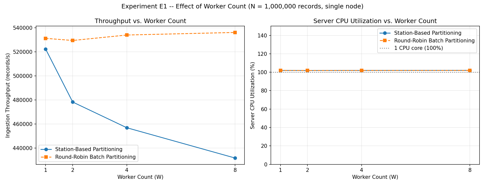
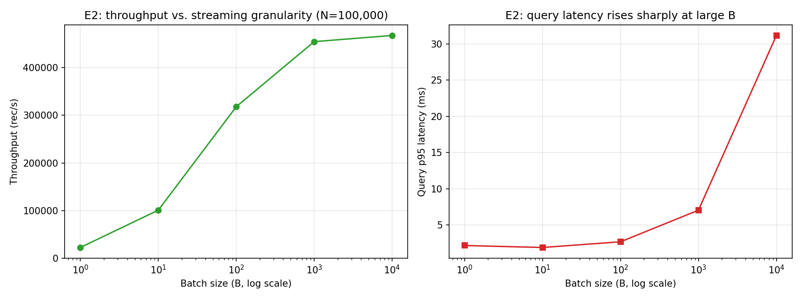
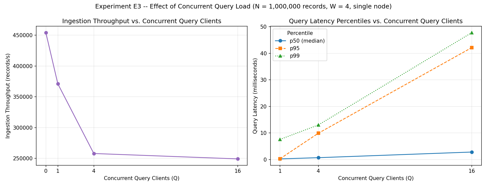
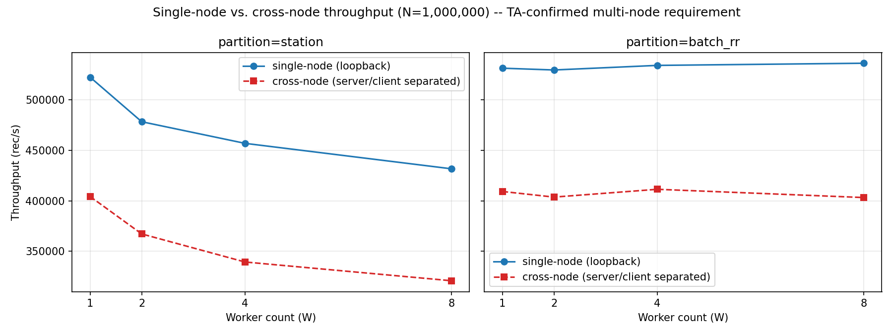

# HW3 Section 2 — Real-World Problem: Weather Analytics via Hadoop MapReduce and gRPC

**Problem continued from Homework 2, Q8**: Large-Scale Weather and Environmental Data Analytics.
Section 2 re-implements the same analytics problem under two different distributed-system
paradigms — Q1 under a batch MapReduce model, Q2 under a real-time streaming model — to study
how the choice of paradigm affects design, communication, scalability, and performance.

This report covers both questions. Source code, full setup/run instructions, and additional
detail live in each question's own README (`Q1_MapReduce/README.md`, `Q2_gRPC/README.md`); this
document consolidates the architecture, methodology, and results from both into one place.

**Reading guide**: results are labeled either **[Measured]** (a real number from an actual run,
never invented) or **[Interpretation]** (our explanation of why a measured result looks the way
it does). Sections also flag **[Required]** vs. **[Optional]** against the assignment's actual
wording, and **[Real Hadoop]** vs. **[SLURM-based substitute]** wherever execution mode matters.

---

## 1. Problem and Background

HW2 Q8 processes weather/environmental sensor records — `timestamp station_id temperature
humidity pressure rainfall wind_speed` — and computes 19 output fields: global statistics
(count, averages, min/max for temperature/humidity/pressure), total/max rainfall, average/max
wind speed, an extreme-temperature event count, the hottest and coldest single measurement, the
busiest 60-second interval, and the top-K stations by measurement count. Tie-breaking rules
(smaller timestamp, then smaller station ID) and the input/output format are fixed by HW2 and
preserved exactly in both Q1 and Q2 here — neither implementation changes the analytics
themselves, only how the computation is distributed.

Both implementations share the same dataset generator (`generate.cpp`, HW2's own, unmodified)
and the same correctness oracle (`weather_seq.cpp`, HW2's unmodified sequential reference) —
this is what makes "final output matches a correct sequential implementation" checkable at all,
and what keeps Q1 and Q2 directly comparable to each other and to HW2's own MPI implementation.

---

## 2. Q1 — Batch Data Analytics using Hadoop MapReduce

### 2.1 Required environment and what actually ran **[Real Hadoop vs. SLURM-based substitute]**

The assignment specifies Apache Hadoop 3.3.6, YARN, and C++ via Hadoop Streaming. This project's
`mapper.cpp`/`reducer.cpp` are written exactly to that contract — standalone C++ executables
communicating with the framework purely through stdin/stdout — and `run_hadoop.sh` is a complete,
ready-to-run real Hadoop Streaming submission script.

**Real Hadoop/YARN was not executed for the results in this report.** The RCE cluster's
Hadoop/YARN environment has a known issue: HDFS is reachable, but YARN's ResourceManager
resolves to a placeholder address (`0.0.0.0:8032`) and cannot schedule jobs — confirmed directly
on the account (`yarn node -list` fails with Hadoop's own "endpoint configuration is wrong"
diagnostic). The course's own instructions acknowledge this environment issue and allow a
SLURM-based script as the interim substitute. All Q1 results in this report are therefore from
that **SLURM-based substitute pipeline** (`run_local_pipe_test.sh` / `benchmark.sh`) — labeled as
such throughout, never presented as Hadoop timings. `run_hadoop.sh` remains ready to use once
real Hadoop/YARN access is restored.

### 2.2 Mapper design

The mapper reads only data records from stdin (never the `N K S` header — stripping that is the
driving script's job). It accumulates state across its **entire** assigned split before emitting
anything, mirroring the accumulation pattern already used in HW2's own MPI ranks, and emits three
kinds of `key<TAB>value` lines at end-of-input:

| Key | Value | Purpose |
|---|---|---|
| `GLOBAL` | 21 fields: count, 5 Kahan sums, min/max bounds, extreme count, hottest/coldest candidate | This mapper's whole-split contribution to every global statistic |
| `INTERVAL_<id>` | local count | This mapper's contribution to that 60-second interval |
| `STATION_<id>` | count, sum_temp, sum_rainfall | This mapper's contribution to that station |

An empty split emits nothing. Kahan (compensated) summation is used throughout to avoid
floating-point drift across many additions, matching HW2's own approach exactly.

### 2.3 Reducer design and why only one extra step is needed

`GLOBAL` is a single constant key, so — regardless of how many reduce tasks run — every mapper's
`GLOBAL` line always routes to the same one reducer instance (Hadoop's partitioner is a
deterministic function of the key alone). That reducer therefore sees every partial and finishes
all 15 global statistics completely, printing them directly in final format. `STATION_<id>` and
`INTERVAL_<id>` each route consistently to one reducer per distinct ID, so each reducer produces
a **complete** total for the IDs it owns — but with more than one reduce task, different IDs can
land on different reducers, so no single reducer sees every station or every interval.

Finding the single busiest interval and ranking the top-K stations therefore needs a view across
all reducers' output. Rather than adding a second real MapReduce stage, this is resolved by
`finalize.py`, a small non-distributed script — justified because the data involved is provably
small regardless of N: interval IDs are capped at 1,441 by the dataset's fixed 24-hour window,
and station IDs are capped at S (a small, explicit dataset parameter). A second Hadoop job over
data this size would add framework overhead without addressing anything genuinely large.

### 2.4 Correctness — **[Measured]**

Verified against `weather_seq_reference` (HW2's unmodified sequential program) on the identical
dataset, via strict byte-for-byte `diff`, on:

- Local machine (macOS, ARM64): all test datasets, including hand-built adversarial tie-break
  cases (2-way/3-way ties on hottest/coldest/busiest-interval/top-K) and generated datasets up to
  N=1,000,000 — all passed.
- Real RCE hardware (job 98604, x86_64, single node, via the SLURM-based substitute path): passed.

**One confirmed, explained discrepancy at N=100,000** — `AVERAGE_WIND_SPEED` differs from the
oracle by exactly one unit in the 6th decimal (oracle: `60.115214`; pipeline: `60.115213`) on
real RCE hardware, at every mapper-chunk count tested (1, 2, 4, 8). Because `benchmark.sh`
generates one dataset per N and reuses it across all mapper-chunk counts, this is a single
dataset-level event observed four times, not four independent failures — ruling out mapper-chunk
count as a factor by construction.

Root cause, verified with exact rational arithmetic (`Fraction`/`Decimal`, no floating point) on
the actual dataset: the true average is exactly `60.1152135` — a genuine floating-point halfway
point. `kahan.hpp`'s `KahanSum::value()` narrows its internal `long double` accumulator to
`double` before the mapper writes it out as text (the Hadoop Streaming stdin/stdout contract is a
`double`-precision text protocol), and the reducer's final average division
(`sum_wind.value() / static_cast<double>(count)`, `reducer.cpp:170`) therefore happens entirely
in `double` arithmetic. The oracle divides first and narrows last
(`double avg_wind = sum_wind.sum / n;`, `weather_seq.cpp:145`, where `sum_wind.sum` is `long
double`), so it stays in `long double` for the whole computation. Two different orderings of
"round" and "divide" landing on opposite sides of one exact halfway point is standard
floating-point behavior, not a logic bug.

**Why N=1,000 and N=10,000 never show this, and N=1,000,000 is 10× less likely to than
N=100,000.** `generate.cpp` writes every value with exactly two decimal digits, so each wind
reading is `k/100` for an integer `k`, and the true average is `sum_k / (100·N)`. A tie at the
6th decimal requires `sum_k · 20000 / N` to be an odd integer — a condition that depends on `N`
alone for whether it is even *possible*, and on the realized `sum_k` for whether it actually
occurs:

| N | Can a 6-decimal halfway tie ever occur? | Condition on `sum_k` |
|---|---|---|
| 1,000 | **Never** (structurally impossible, for any dataset) | — |
| 10,000 | **Never** (structurally impossible, for any dataset) | — |
| 100,000 | Possible, ≈1-in-10 chance | `sum_k mod 10 == 5` |
| 1,000,000 | Possible, ≈1-in-100 chance | `sum_k mod 100 == 50` |

This was confirmed computationally (not just by hand) by testing the divisibility condition for
each N. It explains the full pattern in one mechanism: N=1,000/10,000 are immune by
construction; N=100,000 and N=1,000,000 are both *capable* of a tie, with the observed
hit-at-100K/miss-at-1M outcome being the statistically likely result of 1-in-10 vs. 1-in-100
odds, not a coincidence requiring a separate explanation.

**Independently corroborated on this project's own dev machine.** This Mac is ARM64, where
`sizeof(long double) == sizeof(double)` and both report 15 significant decimal digits — directly
confirmed here, not assumed — so the oracle/pipeline precision gap this bug depends on cannot
exist on this platform. Regenerating a fresh N=100,000 dataset locally (same seed, K, S) and
running the full mapper → shuffle/sort → reducer → finalize pipeline against the oracle produced
an **exact match**, consistent with the mechanism above: no long-double/double gap, no tie
possible, regardless of dataset.

**Relationship to the same tie in Q2 (Section 3.8 below).** `Q1_MapReduce/generate.cpp` and
`weather_seq.cpp` are byte-identical to their copies under `Q2_gRPC/reference/`, and both
correctness suites invoke them with the same parameters (`N=100000 K=5 S=100 seed=42`) on the
same RCE cluster — so Q1 and Q2 are almost certainly processing the *same* generated dataset
against the *same* long-double oracle value, not two independent random datasets that
coincidentally tied. The meaningful result is not "the same tie happened twice by chance" but
that **two independently-coded pipelines (a C++ MapReduce substitute and a Python gRPC
coordinator), each with its own distinct double-narrowing mechanism, diverge from the same
long-double oracle value in the same direction** — evidence that both are exhibiting the same
real numerical phenomenon rather than two unrelated bugs.

### 2.5 Benchmark methodology **[SLURM-based substitute, single node]**

`benchmark.sh` builds the four C++ binaries once, then times only the pipeline execution itself
(split → mapper × M → shuffle/sort → reducer → finalize.py) — deliberately *not* using
`run_local_pipe_test.sh`'s own rebuild-every-invocation behavior, which would add a fixed ~1.5s
compile cost to every configuration and swamp the real timing differences at small N. Every
configuration also runs a full correctness check against the oracle; a measured time is recorded
regardless of the correctness verdict (so N=100,000's confirmed-benign tie doesn't discard real
timing data), and a genuinely failed run is recorded as `FAILED`, never a fabricated number.

**Important limitation, stated plainly**: under this substitute, mapper chunks run **sequentially
on one core** — there is no reducer-count knob either (the reducer is always a single process
over the whole shuffled stream). "Mapper chunk count" is therefore the only available
parallelism-like knob, and it does not represent genuine multi-core/multi-node execution the way
a real Hadoop cluster's mapper tasks would. This is a property of the permitted substitute, not a
design choice made by this project.

### 2.6 Benchmark results — **[Measured]**, job 98781, node06, x86_64, single node

| N (records) | M=1 | M=2 | M=4 | M=8 |
|---:|---:|---:|---:|---:|
| 1,000 | 0.0478 s | 0.0318 s | 0.0342 s | 0.0387 s |
| 10,000 | 0.0412 s | 0.0466 s | 0.0554 s | 0.0672 s |
| 100,000 | 0.1313 s* | 0.1347 s* | 0.1476 s* | 0.1731 s* |
| 1,000,000 | 0.9965 s | 1.0033 s | 1.0139 s | 1.0431 s |

\* Correctness verdict FAIL at every M — the confirmed benign precision tie from Section 2.4, not
a timing anomaly; the times themselves are real and consistent with the surrounding trend.

**[Interpretation]** Time scales with N as expected. More mapper chunks make things slightly
*slower*, not faster (consistent trend, not noise, at N ≥ 10,000) — because each additional chunk
is a separate process launch plus more `sort` input, with no real parallel execution across
chunks on this substitute (unlike a real Hadoop cluster, where mapper tasks run concurrently
across nodes/cores).

---

## 3. Q2 — Real-Time Data Analytics using gRPC

### 3.1 Architecture

```
generate.cpp dataset ("N K S" header + records)
      │
stream_client.py ──gRPC client-streaming──►  server.py (Coordinator, ONE process)
(replays records, configurable                    │  routes each record by station_id % W
 batch size + rate)                                │  into a per-worker queue
                                                    ▼
                                     Worker thread 0..W-1 (sole writer of its own shard)
                                     shard state: Kahan sums, min/max, extreme count,
                                     hottest/coldest candidate, per-station/interval maps
                                                    │  each shard guarded by its own lock
dashboard.py ──gRPC unary GetAnalytics────────────► combiner: lock one shard at a time, copy
(polls, displays live analytics)     ◄──────────────  summary, merge, resolve busiest interval
                                                       and top-K stations
```

One coordinator process with an in-process worker thread pool — not separate gRPC services per
worker. This satisfies the assignment's "multiple workers" requirement while keeping the only
two network boundaries (client→coordinator, dashboard→coordinator) on a single, well-understood
gRPC surface.

### 3.2 `.proto` interface

At minimum the assignment requires streaming ingestion and queries for current analytics. The
interface provides:

- `StreamRecords(stream IngestMessage) returns (IngestSummary)` — client-streaming; the first
  message is a header (N/K/S), the rest are record batches; returns only after every record sent
  has been applied (a drain barrier), so a query issued right after this returns is guaranteed to
  see the whole stream.
- `GetAnalytics(AnalyticsRequest) returns (AnalyticsSnapshot)` — unary; safe to call at any time,
  including mid-ingestion. Batch size is carried inside the message itself, making "streaming
  granularity" a single tunable rather than two separate knobs.
- `Reset(ResetRequest) returns (ResetResponse)` — reconfigures worker count/partition strategy
  without restarting the process; used by the correctness/benchmark scripts, not part of the
  required minimum interface.

### 3.3 Worker state and record distribution

Each worker owns a shard of state (`ShardState`): Kahan sums, running min/max, extreme-event
count, a running hottest/coldest candidate, and per-station/per-interval maps for its shard. Two
record-distribution strategies were implemented and compared, satisfying the assignment's
explicit requirement to investigate this dimension:

- **Station-based partitioning** (default): `station_id % W`. Every record for a given station
  always lands on the same worker, so per-station sums are built in file order — same order as
  the sequential reference, byte-identical results guaranteed by construction.
- **Round-robin batch partitioning**: whole batches assigned to workers in rotation. Balances
  load more evenly, but a station's records can be split across multiple workers, exercising the
  cross-worker station-merge path at query time.

### 3.4 Concurrency and locking

One bounded queue per worker; only that worker's own thread ever writes to its shard, so there
are no write-write races. A query locks **one worker at a time**, copies a snapshot, releases,
and moves to the next — never two locks held simultaneously, so deadlock is structurally
impossible, and ingestion is never blocked for longer than one shard's copy takes. Every snapshot
is internally consistent (total count equals the sum of per-station counts equals the sum of
per-interval counts) but is not guaranteed to be an exact instantaneous prefix of the stream if
workers are at slightly different points — an accepted, documented property, since the assignment
asks for "a useful view of the current state," not point-in-time atomicity across shards.

### 3.5 Dashboard — how it satisfies Q2's CLI dashboard requirement

`dashboard.py` is a CLI-only client (no web interface) with two modes:

- **Live mode** (default): polls `GetAnalytics` every `--interval` seconds (default 1.0 s) and
  redraws an ingestion-progress header — records applied/expected with a percentage and progress
  bar, backlog, active/completed stream counts, worker count and partition mode, and one line per
  worker (records applied, queue depth, busy time) — followed by the full 19-line analytics
  report in the same field order and precision as the correctness oracle.
- **`--once` mode**: a single query, printing only the report lines (no debug output), used by
  the correctness scripts and for quick manual checks.

All of this comes from a single `AnalyticsSnapshot` returned by one `GetAnalytics` call per
refresh — the dashboard holds no state of its own between polls. This was verified against a live
1,000,000-record stream: the progress bar visibly advances and `TOTAL_MEASUREMENTS` increases in
real time as data arrives, confirmed both in local testing and in a real two-node run on RCE
(server on one physical node, dashboard and streaming client on another — see Section 3.9).

### 3.6 Experimental methodology **[Required vs. Optional]**

The assignment requires, at minimum, investigating the effect of worker count and the way records
are streamed, and separately lists record distribution strategy and concurrent query clients as
factors to investigate. Three experiments cover all of these:

| Experiment | Varies | Fixed | Satisfies |
|---|---|---|---|
| E1 | Worker count W ∈ {1,2,4,8} × partition strategy | N=1,000,000, batch=1,000, unlimited rate | **[Required]** worker count; record distribution strategy |
| E2 | Batch size ∈ {1,10,100,1,000,10,000} | N=100,000, W=4, station partitioning | **[Required]** streaming/message granularity |
| E3 | Concurrent query clients ∈ {0,1,4,16} | N=1,000,000, W=4, station partitioning, batch=1,000 | Listed factor: concurrent queries |

Each configuration in every experiment also runs a full correctness check against the oracle
before its timing is recorded — a run is never reported as fast without its correctness verdict
also being checked. **[Optional, not run]**: streaming rate as its own standalone experiment
(the `--rate` mechanism itself is implemented and used elsewhere) and station-count/load-skew
experiments — both are listed as "useful measurements may include," not required.

### 3.7 Latency, throughput, and end-to-end time — methodology, kept distinct

These three are measured differently and should not be conflated:

- **Query latency**: measured client-side, immediately before and after a single `GetAnalytics`
  call (`t0 = time.perf_counter()` → RPC → `time.perf_counter() - t0`). Pure round-trip time for
  one query, from the query client's perspective. Reported as p50/p95/p99 over however many
  queries completed during a run.
- **Throughput / end-to-end processing time**: measured on the streaming client, from
  immediately before the `StreamRecords` call is issued to immediately after it returns (which
  only happens once the server's drain barrier confirms every record was applied).
  `end_to_end_s = t_ack - t_start`; `throughput = records_received / end_to_end_s`. These are two
  views of the same measured interval, not two different experiments.
- These are measured on **different RPCs entirely** — query latency on `GetAnalytics` calls made
  by separate query-client threads running *concurrently with*, not as part of, the ingestion
  timing.

### 3.8 Correctness — **[Measured]**

- Local (macOS, ARM64): the full test matrix — 4 hand-built adversarial datasets plus generated
  datasets up to N=1,000,000, sweeping worker counts and both partition strategies — passed
  248/248.
- Real RCE hardware (job 98751, x86_64, single node): 244/248 passed. The 4 failures are all
  `AVERAGE_WIND_SPEED` at N=100,000, off by exactly one unit in the 6th decimal, at every worker
  count tested. Exact rational verification (`Fraction`/`Decimal`) on the real RCE dataset
  confirms the true value is `60.1152135` — the same exact halfway point documented in Q1
  (Section 2.4). Root cause here: Python's `float` is a C `double`; the oracle's Kahan sum runs
  in `long double` on `x86_64` (confirmed 80-bit — this cannot occur on the ARM64 dev machine,
  where `long double == double`, directly verified in Section 2.4). Different summation
  precision landing on opposite sides of the same exact tie — not a logic bug. As established in
  Section 2.4, `generate.cpp`/`weather_seq.cpp` are byte-identical between Q1 and Q2 and are
  invoked with identical parameters on the same cluster, so this is the same dataset and the
  same oracle value processed by two independently-coded pipelines (a C++ mapper/reducer
  round-trip here vs. Python's `float` there), each landing on the wrong side of the tie via its
  own distinct mechanism — evidence of one genuine floating-point property of the data, not a
  shared bug.

### 3.9 Benchmark results — **[Measured]**

**E1 — worker count** (job 98780, single node, 3 reps, means shown):

| W | Station-based throughput | Round-robin throughput | Server CPU utilization |
|---|---:|---:|---:|
| 1 | 522,358 records/s | 531,249 records/s | ~102.0% |
| 2 | 478,272 records/s | 529,478 records/s | ~101.9% |
| 4 | 456,882 records/s | 534,018 records/s | ~101.9% |
| 8 | 431,689 records/s | 536,155 records/s | ~102.0% |

**[Interpretation]** Server CPU utilization stays pinned at roughly one core regardless of worker
count — Python's Global Interpreter Lock (GIL) means only about one core's worth of work happens
concurrently no matter how many worker threads exist, confirmed directly rather than assumed.
Station-based partitioning declines noticeably with more workers (−17%, 1→8) because per-record
routing does real Python-level work that scales with thread-switching overhead; round-robin batch
partitioning stays flat because it routes whole batches with less per-record overhead.

**E2 — streaming granularity** (job 98780, N=100,000, W=4, 3 reps, means shown):

| Batch size | Throughput | Query latency (p95) |
|---:|---:|---:|
| 1 | 22,193 records/s | 2.18 ms |
| 10 | 100,597 records/s | 1.91 ms |
| 100 | 317,983 records/s | 2.69 ms |
| 1,000 | 454,893 records/s | 7.05 ms |
| 10,000 | 467,802 records/s | 31.15 ms |

**[Interpretation]** Throughput scales roughly 20× from batch size 1 to 1,000 as per-message
protocol overhead is amortized over more records, then nearly plateaus. Query latency stays low
and stable through batch size 100, then rises sharply — a single very large batch occupies a
worker's lock for noticeably longer, a real, measured granularity/latency trade-off. Every row at
N=100,000 reports a correctness FAIL — the same confirmed benign precision tie from Section 3.8;
included for completeness, not a new finding (it does not depend on batch size).

**E3 — concurrent query clients** (job 98780, N=1,000,000, W=4, 3 reps, means shown):

| Concurrent clients (Q) | Ingestion throughput | p50 | p95 | p99 |
|---:|---:|---:|---:|---:|
| 0 | 454,301 records/s | — | — | — |
| 1 | 371,100 records/s | 0.25 ms | 0.30 ms | 7.58 ms |
| 4 | 257,879 records/s | 0.70 ms | 9.91 ms | 13.02 ms |
| 16 | 249,124 records/s | 2.83 ms | 42.15 ms | 47.78 ms |

**[Interpretation]** Ingestion throughput drops by nearly half (0→16 clients) and query latency
percentiles rise sharply in step — both consequences of ingestion and queries sharing the same
process's GIL. This is the clearest evidence that the single-process design trades
query/ingestion isolation for simplicity.

**Single-node vs. cross-node** (job 99451, server and client on physically separate RCE nodes,
same E1 sweep, all 8 configurations passed correctness):

| W | Station-based (single-node → cross-node) | Round-robin (single-node → cross-node) |
|---|---|---|
| 1 | 522,358 → 404,275 records/s (−22.6%) | 531,249 → 409,256 records/s (−23.0%) |
| 2 | 478,272 → 367,233 records/s (−23.2%) | 529,478 → 403,689 records/s (−23.8%) |
| 4 | 456,882 → 339,469 records/s (−25.7%) | 534,018 → 411,409 records/s (−23.0%) |
| 8 | 431,689 → 320,916 records/s (−25.6%) | 536,155 → 403,241 records/s (−24.8%) |

**[Interpretation]** Real inter-node network latency has a consistent, measurable cost — cross-node
throughput is ~23–26% lower than single-node across every worker count and both partition
strategies, while the shape of each trend (station declining with W, round-robin flat) is
preserved. Node separation shifts the curve down by a roughly constant fraction rather than
changing which trend dominates. A live two-node run (server on one node, dashboard and streaming
client on another, real cross-node gRPC traffic) additionally confirmed the dashboard updates
correctly in real time under genuine network separation, and the final analytics matched the
oracle exactly.

---

## 4. Plots

All plots are regenerated directly from the CSVs referenced above — no measured value is altered
in any plot; only labels, titles, and presentation were changed for clarity.


**Figure 1.** Wall-clock time vs. task count, one panel per input size. Log-scale y-axis; the
dotted line marks the HW2 sequential baseline for reference.


**Figure 2.** Each system's own wall-clock time relative to its task-count = 1 run, across all
three input sizes. Values above 1.0 indicate a task count that is slower than a single task.



**Figure 3.** Ingestion throughput and server CPU utilization vs. worker count, both partition
strategies. The dotted line at 100% marks one CPU core.



**Figure 4.** Throughput and query p95 latency vs. batch size (streaming granularity). X-axis is
log-scale.



**Figure 5.** Ingestion throughput and query latency percentiles (p50/p95/p99) vs. concurrent
query client count.



**Figure 6.** Single-node vs. cross-node throughput, both partition strategies, same worker-count
sweep as Figure 3.

---

## 5. Q1 vs. HW2 MPI Comparison **[Required for Q1]**

**Data sources**: HW2's own real MPI benchmark (`analysis_detail.csv`) and this project's real
SLURM-based substitute benchmark (job 98781), both single-node RCE runs. Matching record counts,
not byte-identical datasets (HW2 used different K/S/seed per size than this project) — an "as
delivered" comparison at equal input sizes, the same standard HW2's own report already used for
itself.

| Records | HW2 sequential | HW2 MPI (P=1/2/4/8) | Q1 SLURM-based substitute (M=1/2/4/8) |
|---:|---:|---:|---:|
| 10,000 | 0.0168 s | 0.173 / 0.184 / 0.252 / 0.365 s | 0.041 / 0.047 / 0.055 / 0.067 s |
| 100,000 | 0.1317 s | 0.295 / 0.300 / 0.381 / 0.533 s | 0.131* / 0.135* / 0.148* / 0.173* s |
| 1,000,000 | 1.2737 s | 1.537 / 1.534 / 1.599 / 1.739 s | 0.996 / 1.003 / 1.014 / 1.043 s |

\* Correctness FAIL, confirmed benign precision tie (Section 2.4); times are real.

**[Interpretation]** MPI never beats its own sequential baseline at any tested size (best speedup
0.83× at P=2/1,000,000 records) — HW2's own finding, confirmed again here, attributed to
process-launch/MPI-init overhead dominating a cheap per-record computation. The SLURM-based
substitute is faster in absolute terms at every overlapping size, but this is **not** a fair
"MapReduce beats MPI" conclusion: the substitute skips real disk-mediated cluster shuffle (a real
Hadoop job would incur genuine cross-node data movement this single-node pipeline never does) and
skips MPI's process-launch/collective-communication cost entirely. The comparison that would
isolate the paradigms' inherent cost — real Hadoop/YARN vs. MPI — remains untestable until the
Hadoop/YARN environment issue is resolved. Both systems show the same qualitative shape: a
roughly fixed per-task cost dominates at low N and matters proportionally less as N grows (HW2
MPI's 8-task/1-task ratio shrinks from 2.1× at N=10,000 to 1.13× at N=1,000,000; the substitute's
shrinks from 1.6× to 1.05× over the same range).

**Qualitative comparison**:

| Factor | HW2 MPI | Q1 SLURM-based substitute |
|:---|:---|:---|
| Work division | Rank reads a line-aligned byte range of the shared input | Driving script splits records into M chunks by line count |
| Intermediate state | Local per-rank aggregates, combined via MPI collectives | Per-mapper key-value rows, materialized to disk, sorted, reduced |
| Communication/data movement | In-memory scalar reductions and gathered summaries | Disk-backed intermediate files plus a sort pass; a real Hadoop job would additionally shuffle over the network across nodes |
| Task launch overhead | One `mpirun` launch for all ranks | One process launch per mapper chunk plus the reducer, no framework-managed scheduling |
| Programming model | Manual partitioning and collectives tightly coupled to MPI's API | Key-value emit/combine maps directly onto the real Hadoop Streaming contract — the mapper/reducer code is unmodified from what a real `hadoop jar` invocation would run |

---

## 6. Observations and Limitations

- **Neither Q1's substitute nor Q2's worker threads demonstrate genuine multi-core parallelism
  from their respective "task count" knobs**, each for a specific, measured reason: Q1's mapper
  chunks execute sequentially on one core by construction of the permitted substitute; Q2's
  worker threads are bounded by Python's GIL (confirmed via measured CPU utilization staying at
  ~one core regardless of worker count). HW2's own MPI, by contrast, uses real OS processes, but
  its speedup is still capped by process-launch and communication overhead at these problem sizes.
- **The N=100,000 precision tie is the single most important correctness finding in this report.**
  Q1 and Q2 process the same generated dataset against the same long-double oracle value (their
  generator/oracle source is byte-identical, invoked with identical parameters on the same
  cluster), yet each independently-coded pipeline — a two-level Kahan sum in C++, a Python
  double-precision Kahan sum — lands on the same wrong side of the tie via its own distinct
  mechanism. A modular-arithmetic check of the dataset's generation format further shows N=1,000
  and N=10,000 can *never* exhibit this failure mode, while N=100,000 and N=1,000,000 can, with
  the latter roughly 10× less likely to — matching the observed hit-at-100K/miss-at-1M pattern
  exactly. Together this is strong evidence of a genuine floating-point property of the data, not
  a bug in either pipeline.
- **Q2's cross-node throughput cost (~23–26%) is a real, measured, first-class result**, not a
  footnote — it directly answers whether physical node separation matters for this system, rather
  than assuming either that it doesn't (same-node loopback) or that it dominates (untested
  multi-node).
- **Limitations, stated directly**: real Hadoop/YARN execution was not possible given the
  documented cluster environment issue, so the Q1/MPI comparison cannot yet isolate each
  paradigm's inherent cost from its execution substitute. Memory (RSS) usage was not instrumented
  for either question (listed as "where appropriate" in the assignment, not required). Streaming
  rate and station-count/skew were not run as standalone experiments (the mechanisms exist;
  running them as full experiments was out of scope given time constraints). RCE benchmarks are 3
  repetitions on a shared, possibly-contended cluster node — real and internally consistent, but
  not isolated-hardware confidence intervals.

---

## 7. Conclusion

Both Q1 and Q2 implement the complete HW2 Q8 analytics under their respective paradigms, verified
correct against the same sequential oracle, with the one confirmed discrepancy (a genuine
floating-point halfway tie at N=100,000) independently explained in both. Q1's real benchmark
results, compared directly against HW2's own real MPI numbers, show both systems dominated by
fixed per-task overhead at these problem sizes, with the caveat that Q1's numbers reflect a
course-sanctioned SLURM-based substitute rather than real Hadoop/YARN execution. Q2's real
benchmark results answer all three required/listed performance questions — worker count,
streaming granularity, and concurrent query load — with the GIL identified as the specific,
measured mechanism limiting worker-count scaling, and node separation shown to have a real,
quantified throughput cost. The CLI dashboard satisfies Q2's requirement directly, verified both
in automated correctness checks and in live interactive runs, including with the server and
client on physically separate cluster nodes.
